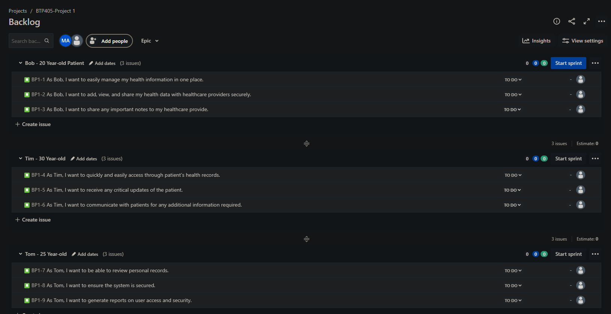
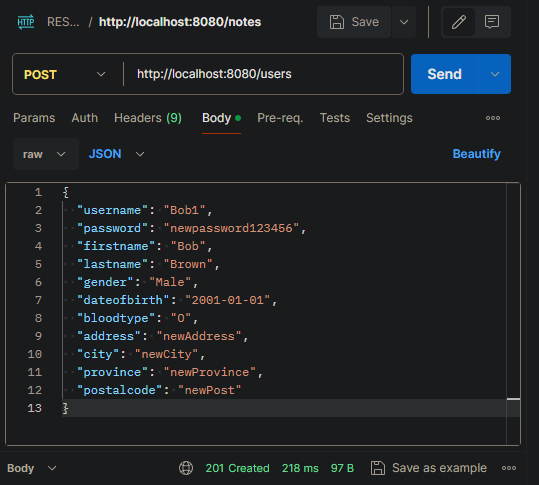
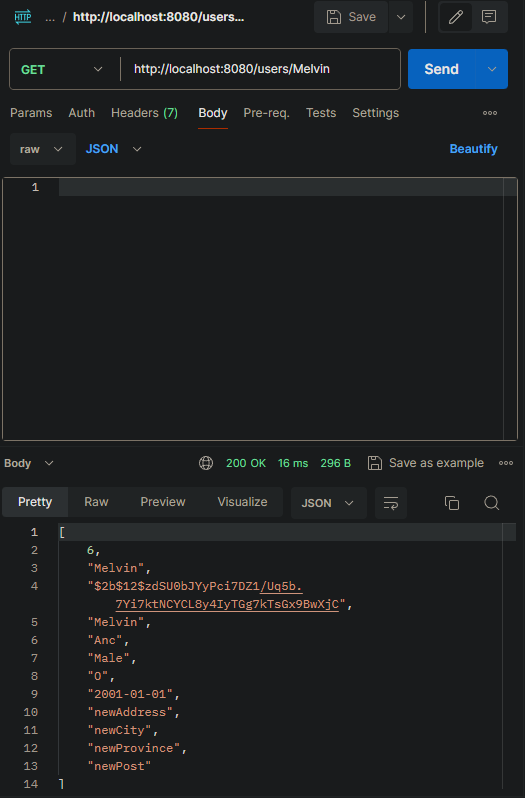
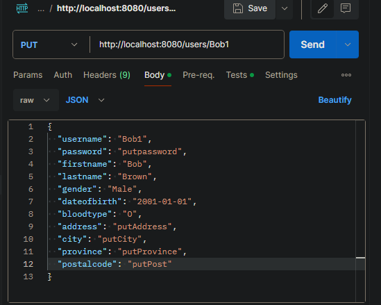
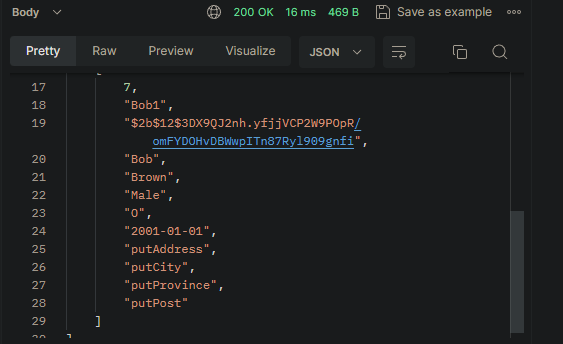
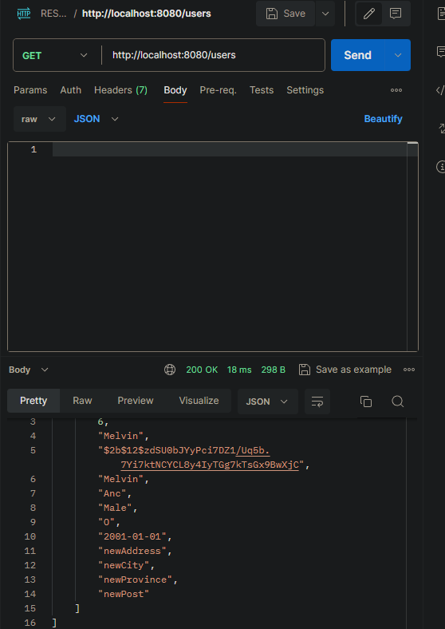

Melvin Ancheta  
BTP405 - Project 1  

Project Vision and Management (Chapter 1):  
Vision of the PHR system:  
For Clients or Patients in a medical clinic, who need to keep track of their personal health record,The Healthcare Provider is a cloud-based Personal Health Record (PHR) system that allows users to manage their health information in one place. UNLIKE other services or package cloud-based systems, OUR product enables users to add, view, and share their health data with healthcare providers securely.

Product Development Lifecycle:  
Concept:  
Define the product vision and objectives  
Identify various stakeholders, such as users, healthcare providers, and managers.  
Set goals through different stages of development  

Inception:  
Define the agile development team and their assigned roles such as Product Owner, Scrum Master.  
Assign agile team members with given tasks for a given time period.  
Set up development tools and fund resources  

Iteration:  
The agile development team will begin to do their assigned tasks.  
Developers and designers will work together.  
Combine all the requirements for the products and customer reactions to turn all of it into code.  

Release:  
The agile development team will test out the code.  
Ensure that the system’s integrity and functionality meets the requirements.  
Release to the customers and stakeholders for any necessary feedback.  
Implement any important feedback to the system.  

Maintenance:  
System should be ready to fully deploy and become available to customers.  
The agile development team should provide ongoing support to customers.  
If there are any issues or bugs in the system, address it to the users.  

Retirement:  
If the system is no longer in use, it will end and will retire.  
If there is a replacement, the agile development team will announce where the customers will move to.  
Support will no longer be needed for the old system, and will move to the new system with any new required improvements.  

Agile Software Engineering (Chapter 2):  
User Stories:  
https://melvin-ancheta.atlassian.net/jira/software/projects/BP1/boards/2/backlog\  

User-Centered Design (Chapter 3):  
Personas (System’s end-users: patients, doctors, health administrators)  
Persona 1: Bob - 20-Year-Old Patient  
Bob, age 20, is a student, who is currently studying software development in college. His current health status seems to be healthy according to his doctor. He wants to make sure he stays healthy, so he would like a system where he can manage his personal health information in one place. The system should also let him add, view, and share his health data with healthcare providers securely.  

Persona 2: Tim- 30-Year-Old Doctor  
Tim, age 30, is a family doctor, who is currently working at a family clinic, who handles multiple patients. Since he deals with multiple patients, he would like a system that can easily and quickly access the patient’s health information when needed. Any information update needed for the patient's health and treatment should be in real-time.  

Persona 3: Tom - 25-Year-Old Health Administrators  
Tom, age 25, is one of the health administrators that works at the same family clinic as Tim. Since there are a lot of patients at the clinic and have all of their personal health records in the system, Tom needs to make sure that the data is secured at all times.He is in charge of the record system, and has to deal with the data, making sure the information is meeting the requirements.  

Scenario:  
Scenario 1: Bob books an appointment  
Bob wants to book a doctor’s appointment with Tim, for a yearly checkup. Tim told Bob that in order to book the appointment, he had to fill out a personal health record in their system, for yearly checkups. The personal health record consists of the patient’s information such as name, address, date of birth, family doctor, and any medical condition, allergies or notes that the doctor must know.  

Scenario 2: Tim’s appointment with Bob  
Tim gets multiple patients everyday, therefore, he needs personal health for each of those patients. With Bob’s appointment with Tim, Tim made sure to review Bob’s personal health record to see what he needs to deal with. During the appointment, if anything needed to be changed, he would be able to update it in real-time.  

Scenario 3: Tom reviews Bob’s record  
After the appointment between Tim and Bob, Tom needs to finalize his personal health record to meet the health clinic’s regulations. Therefore, Tom needs to access the Personal Health Record system, in order to review any updated logs. With reviewing personal records, he needs to make sure that it is saved and secured in the system.  

User Stories:  
User Story 1: Bob - Patient  
As Bob, I want to easily manage my health information in one place.  
As Bob, I want to add, view, and share my health data with healthcare providers securely.  
As Bob, I want to share any important notes to my healthcare provider.  

User Story 2: Tim - Doctor  
As Tim, I want to quickly and easily access through patient’s health records.  
As Tim, I want to receive any critical updates of the patient.  
As Tim, I want to communicate with patients for any additional information required.  

User Story 3: Tom - Health Administrator  
As Tom, I want to be able to review personal records.   
As Tom, I want to ensure the system is secured.  
As Tom, I want to generate reports on user access and security.  

User Guide:  
POST Methods:  

GET Methods:  

PUT Methods:  

DELETE Method:  

  Project Report:  
During this project development, there has been a lot of stress during the whole process of this project, but there have been some lessons learned, which I can apply to my future work. Some of the stress that I was dealing with during this project was to compose the project as a Docker Container. I kept on getting an error because the database port was already in use. That took me a bit of time to solve this issue. Another reason why I was stressed during the project was because I started to work on this late, when I should have started to work on it earlier.
After dealing with all this stress, I have learned a lot during the process of this project. First lesson I learned was to create a project planner for the development team using agile methodologies and agile software engineering using scrum. Another lesson that I have learned was to create an API project that stores information into a database with additional features such as security and privacy. For security, the user must authenticate using their username and password. The password must be hashed in the database in order for it to be secured. For privacy, the user should only be able to see their personal health record, and should see other users record. The last lesson learned when I finished this project was that as soon as the project is released, I should take a look and start the project, and to not leave at the last minute.
For future work, if I ever feel that I am stressed when I am stuck or having problems with my work, I should ask questions, especially when the professor asks if there are any questions during lectures or labs.
